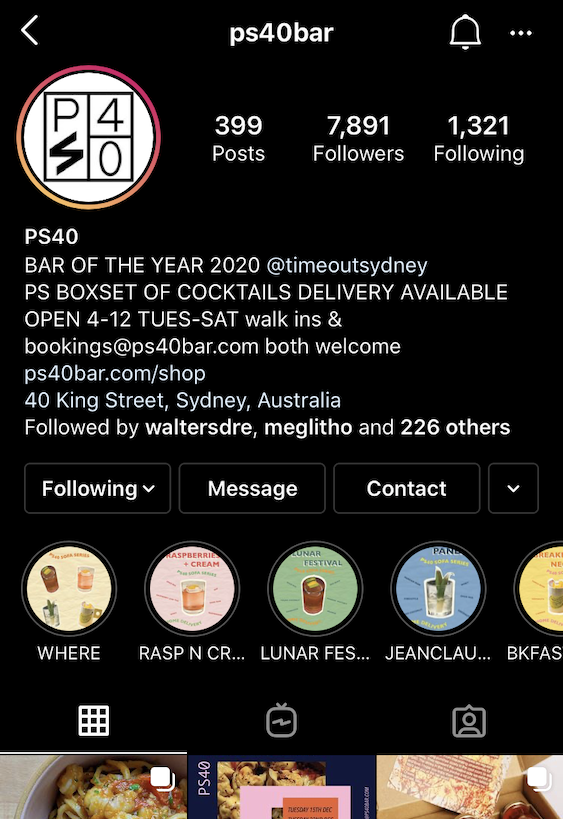
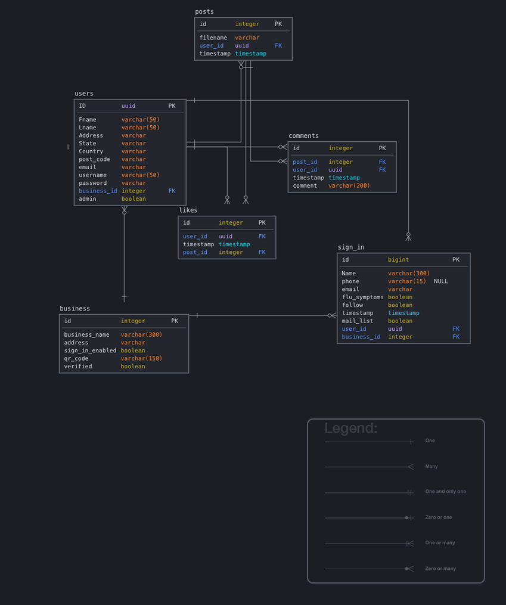

<!-- PROJECT SHIELDS -->
<!--
*** I'm using markdown "reference style" links for readability.
*** Reference links are enclosed in brackets [ ] instead of parentheses ( ).
*** See the bottom of this document for the declaration of the reference variables
*** for contributors-url, forks-url, etc. This is an optional, concise syntax you may use.
*** https://www.markdownguide.org/basic-syntax/#reference-style-links
-->
[![Contributors][contributors-shield]][contributors-url]
[![Forks][forks-shield]][forks-url]
[![Stargazers][stars-shield]][stars-url]
[![Issues][issues-shield]][issues-url]
[![MIT License][license-shield]][license-url]
[![LinkedIn][linkedin-shield]][linkedin-url]


<!-- PROJECT LOGO -->
<br />
<p align="center">

  <h1 align="center">Insta-Sign</h1>

  <p align="center">
    A covid sign in extension for instagram.
    <br />
    <a href="https://github.com/petelah/insta-sign"><strong>Explore the docs »</strong></a>
    <br />
    <br />
    <a href="https://github.com/petelah/insta-sign">View Demo</a>
    ·
    <a href="https://github.com/petelah/insta-sign/issues">Report Bug</a>
    ·
    <a href="https://github.com/petelah/insta-sign/issues">Request Feature</a>
  </p>
</p>


<!-- TABLE OF CONTENTS -->
<details open="open">
  <summary><h2 style="display: inline-block">Table of Contents</h2></summary>
  <ol>
    <li>
      <a href="#about-the-project">About The Project</a>
      <ul>
        <li><a href="#built-with">Built With</a></li>
      </ul>
    </li>
    <li>
      <a href="#getting-started">Getting Started</a>
      <ul>
        <li><a href="#prerequisites">Prerequisites</a></li>
        <li><a href="#installation">Installation</a></li>
      </ul>
    </li>
    <li><a href="#usage">Usage</a></li>
    <li><a href="#features">Features</a></li>
    <li><a href="#wireframes">Wireframes & Workflow</a></li>
    <li><a href="#arch">Cloud Architecture</a></li>
    <li><a href="#license">License</a></li>
    <li><a href="#contact">Contact</a></li>
    <li><a href="#acknowledgements">Acknowledgements</a></li>
  </ol>
</details>


<!-- ABOUT THE PROJECT -->
## About The Project



Insta-sign integrates directly with instagram so you do not need to sign up to any 
covid sign in services anymore. You can just offer a qr code to sign in where you can capture emails and follows to your 
profile. Or sign in directly from your profile link. If you have a menu available online you can redirect to it as well.


### Built With

* [Python]()
* [Flask]()
* [Bootstrap]()


<!-- GETTING STARTED -->
## Getting Started

As this is done as a proof of concept and an assignment for Coder Academy. This can be run locally but has no official integration 
with instagram at all.

### Prerequisites

Prerequisites is to have python 3.7+, pip and pip-env installed

### Installation

```sh
git clone https://github.com/petelah/insta-sign.git
cd insta-sign
python -m venv venv
source venv/bin/activate
pip3 install -r requirements.txt
export FLASK_APP=run.py
```


<!-- USAGE EXAMPLES -->
## Usage

As this is done as a proof of concept and an assignment for Coder Academy. This can be run locally but has no official integration 
with instagram at all.

```sh
flask run
```

Open your browser to http://127.0.0.1:5000


<!-- FEATURES -->
## Features

* Sign in with instagram or facebook account
* Auto generate qr codes
* Gain followers
* Capture emails for future marketing


<!-- WW -->
## Wireframes & Workflow

Wireframes


<!-- CLOUDARCH -->
## Cloud Architecture

Cloud architecture diagrams go here

<!-- LICENSE -->
## License

Distributed under the MIT License. See `LICENSE` for more information.


<!-- CONTACT -->
<div id="contact"></div>

## Contact

Peter Seabrook - [@PeterSeabrook](https://twitter.com/PeterSeabrook) - peter@peterseabrook.com

Project Link: [https://github.com/petelah/insta-sign](https://github.com/petelah/insta-sign)


<!-- ACKNOWLEDGEMENTS -->
## Acknowledgements

* [Coder Academy]()
* [Bruce McClure]()
* [Garret Blankenship]()
* [Jamal Diab]()


<!-- MARKDOWN LINKS & IMAGES -->
<!-- https://www.markdownguide.org/basic-syntax/#reference-style-links -->
[contributors-shield]: https://img.shields.io/github/contributors/petelah/repo.svg?style=for-the-badge
[contributors-url]: https://github.com/petelah/insta-sign/graphs/contributors
[forks-shield]: https://img.shields.io/github/forks/petelah/repo.svg?style=for-the-badge
[forks-url]: https://github.com/petelah/insta-sign/network/members
[stars-shield]: https://img.shields.io/github/stars/petelah/repo.svg?style=for-the-badge
[stars-url]: https://github.com/petelah/insta-sign/stargazers
[issues-shield]: https://img.shields.io/github/issues/petelah/repo.svg?style=for-the-badge
[issues-url]: https://github.com/petelah/insta-sign/issues
[license-shield]: https://img.shields.io/github/license/petelah/repo.svg?style=for-the-badge
[license-url]: https://github.com/petelah/insta-sign/blob/master/LICENSE.txt
[linkedin-shield]: https://img.shields.io/badge/-LinkedIn-black.svg?style=for-the-badge&logo=linkedin&colorB=555
[linkedin-url]: https://linkedin.com/in/peter-seabrook-0b03bb181/
