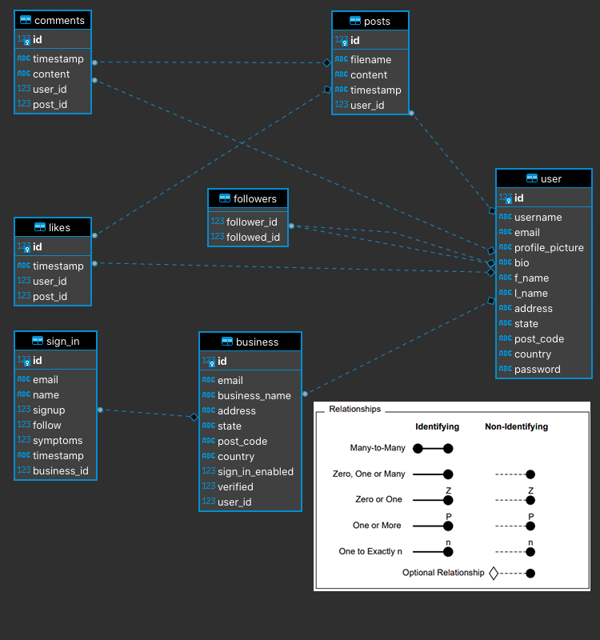

<!-- PROJECT SHIELDS -->
<!--
*** I'm using markdown "reference style" links for readability.
*** Reference links are enclosed in brackets [ ] instead of parentheses ( ).
*** See the bottom of this document for the declaration of the reference variables
*** for contributors-url, forks-url, etc. This is an optional, concise syntax you may use.
*** https://www.markdownguide.org/basic-syntax/#reference-style-links
-->
[![Forks][forks-shield]][forks-url]
[![Stargazers][stars-shield]][stars-url]
[![Issues][issues-shield]][issues-url]
[![MIT License][license-shield]][license-url]
[![LinkedIn][linkedin-shield]][linkedin-url]


<!-- PROJECT LOGO -->
<br />
<p align="center">

  <h1 align="center">Insta-Sign</h1>

  <p align="center">
    A covid sign in extension for instagram.
    <br />
    <a href="https://github.com/petelah/insta-sign"><strong>Explore the docs »</strong></a>
    <br />
    <br />
    <a href="https://github.com/petelah/insta-sign">View Demo</a>
    ·
    <a href="https://github.com/petelah/insta-sign/issues">Report Bug</a>
    ·
    <a href="https://github.com/petelah/insta-sign/issues">Request Feature</a>
  </p>
</p>


<!-- TABLE OF CONTENTS -->
<details open="open">
  <summary><h2 style="display: inline-block">Table of Contents</h2></summary>
  <ol>
    <li>
      <a href="#about-the-project">About The Project</a>
      <ul>
        <li><a href="#built-with">Built With</a></li>
      </ul>
    </li>
    <li>
      <a href="#getting-started">Getting Started</a>
      <ul>
        <li><a href="#prerequisites">Prerequisites</a></li>
        <li><a href="#installation">Installation</a></li>
      </ul>
    </li>
    <li><a href="#usage">Usage</a></li>
    <li><a href="#features">Features</a></li>
    <li><a href="#wireframes">Wireframes & Workflow</a></li>
    <li><a href="#deployment">Deployment</a></li>
    <li><a href="#arch">Cloud Architecture</a></li>
    <li><a href="#license">License</a></li>
    <li><a href="#contact">Contact</a></li>
    <li><a href="#acknowledgements">Acknowledgements</a></li>
  </ol>
</details>


<div id="about-the-project"></div>
<!-- ABOUT THE PROJECT -->

## About The Project


Insta-sign integrates directly with instagram so you do not need to sign up to any 
covid sign in services anymore. You can just offer a qr code to sign in where you can capture emails and follows to your 
profile. Or sign in directly from your profile link. If you have a menu available online you can redirect to it as well.

Integration is as easy as enabling it if you hold a business account and your business is verified.

This has been designed to run both the front end and back end API on the same server.

Users are authenticated on the front end using sessions via flask-login and the API will server users with JWT's so
it is easily integrable with any mobile app framework as well.

To the dudes marking this - I had a great time creating this little guy, please find the answers to the report questions 
in docs/ =).

<div id="built-with"></div>

### Built With

* [Python]()
* [Flask]()
* [Bootstrap]()


<div id="getting-started"></div>
<!-- GETTING STARTED -->

## Getting Started

As this is done as a proof of concept and an assignment for Coder Academy. This can be run locally but has no official integration 
with instagram at all.


<div id="prerequisites"></div>

### Prerequisites

Prerequisites is to have python 3.7+, pip and pip-env installed

<div id="installation"></div>

### Installation

```sh
git clone https://github.com/petelah/insta-sign.git
cd insta-sign
python -m venv venv
source venv/bin/activate
pip3 install -r requirements.txt
export FLASK_APP=run.py
```
Rename the .env.example file to .env and fill in your environment variables.


<!-- USAGE EXAMPLES -->
<div id="usage"></div>

## Usage

As this is done as a proof of concept and an assignment for Coder Academy. This can be run locally but has no official integration 
with instagram at all.

Setup the db:
```sh
flask db-custom create
```

If you wish to have test users run:
```sh
flask db-custom seed
```

```sh
flask run
```

Open your browser to http://127.0.0.1:5000/

or you can test the rest API endpoints with the swagger file provided in docs/ folder.


<!-- FEATURES -->
<div id="features"></div>

## Features

* Sign in with instagram or facebook account
* Auto generate qr codes - coming soon
* Gain followers when people sign into your venue or business
* Capture emails for future marketing
* Admin panel for approving businesses and dumping the db


<!-- WW -->
<div id="wireframes"></div>

## Wireframes & Workflow

### Wireframes
#### Login:


#### Feed:


#### Profile:


#### Sign In:


#### Entity relationship Diagram:



## Constraints

#### User constraints:
* Constraints placed on the user by restricting access to the admin panel and routes. 
* Access is granted and revoked via front end using sessions and API via JWT. 
* Users cannot edit other users profiles, and a user cannot verify their own business or another users business, only an admin can do that.
* A user can have only one business account only.
* A user can like another users post
* A user can follow and unfollow another user
* A user can create and delete their own posts
* A user can comment on another users post


#### Business constraints:
* A Business cannot accept any sign in's unless the business is approved by an admin. Once approved they can only access user data that have the user has opted to give them.


#### Anonymous users:
* Anonymous or unregistered users have the ability to view profiles and sign in, they have no other access to endpoints.

<!-- DEPLOYMENT -->
<div id="deployment"></div>

## Deployment

CI/CD is handled with GitHub actions.

The initial push to dev branch will execute tests and syntax linting.
Once it is built and tests are passed in the docker environment the code is them merged via pull request from 
dev to main.

Upon a successful merge the code will then be deployed to Amazon AWS on an EC2 instance, if a previous instance is running 
it will be torn down, rebuilt and started as a system service.

<!-- CLOUDARCH -->
<div id="cloudarch"></div>

## Cloud Architecture

Cloud architecture would be extremely simple for this add on. The following diagram has the example running in it's own aws region for 
proof of concept purposes. However in the real world this would integrate straight into Instagram's existing architecture.


<!-- LICENSE -->
<div id="license"></div>

## License

Distributed under the MIT License. See `LICENSE` for more information.


<!-- CONTACT -->
<div id="contact"></div>

## Contact

Peter Seabrook - [@PeterSeabrook](https://twitter.com/PeterSeabrook) - peter@peterseabrook.com

Project Link: [https://github.com/petelah/insta-sign](https://github.com/petelah/insta-sign)


<!-- ACKNOWLEDGEMENTS -->
<div id="acknowledgements"></div>

## Acknowledgements

* [Coder Academy]()
* [Bruce McClure]()
* [Garret Blankenship]()
* [Jamal Diab]()
* [Aigars Silkalns](https://codepen.io/colorlib/pen/rxddKy) - Amazing HTML5 & CSS forms
* [George W. Park](https://codepen.io/GeorgePark/pen/VXrwOP) - Instagram UI


<!-- MARKDOWN LINKS & IMAGES -->
<!-- https://www.markdownguide.org/basic-syntax/#reference-style-links -->
[forks-shield]: https://img.shields.io/github/forks/petelah/insta-sign.svg?style=for-the-badge
[forks-url]: https://github.com/petelah/insta-sign/network/members
[stars-shield]: https://img.shields.io/github/stars/petelah/insta-sign.svg?style=for-the-badge
[stars-url]: https://github.com/petelah/insta-sign/stargazers
[issues-shield]: https://img.shields.io/github/issues/petelah/insta-sign.svg?style=for-the-badge
[issues-url]: https://github.com/petelah/insta-sign/issues
[license-shield]: https://img.shields.io/github/license/petelah/insta=sign.svg?style=for-the-badge
[license-url]: https://github.com/petelah/insta-sign/LICENSE.txt
[linkedin-shield]: https://img.shields.io/badge/-LinkedIn-black.svg?style=for-the-badge&logo=linkedin&colorB=555
[linkedin-url]: https://linkedin.com/in/peter-seabrook-0b03bb181/